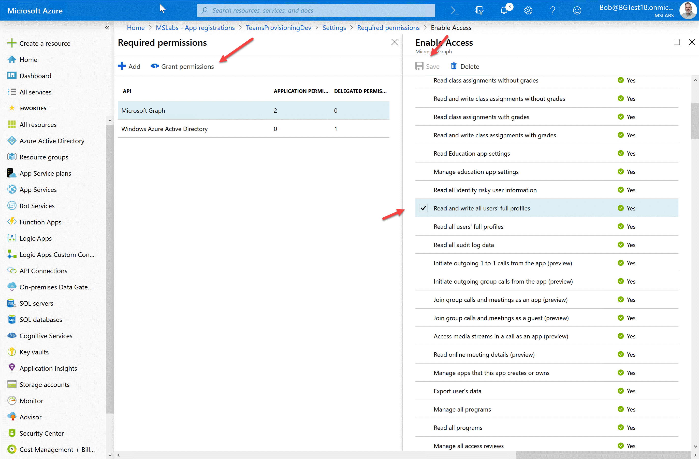
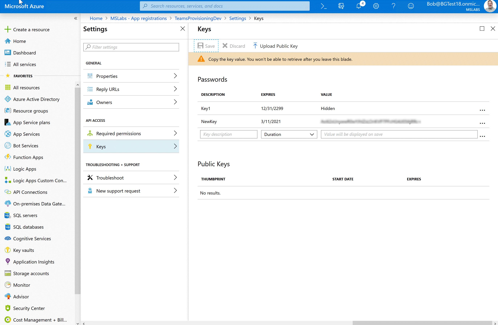
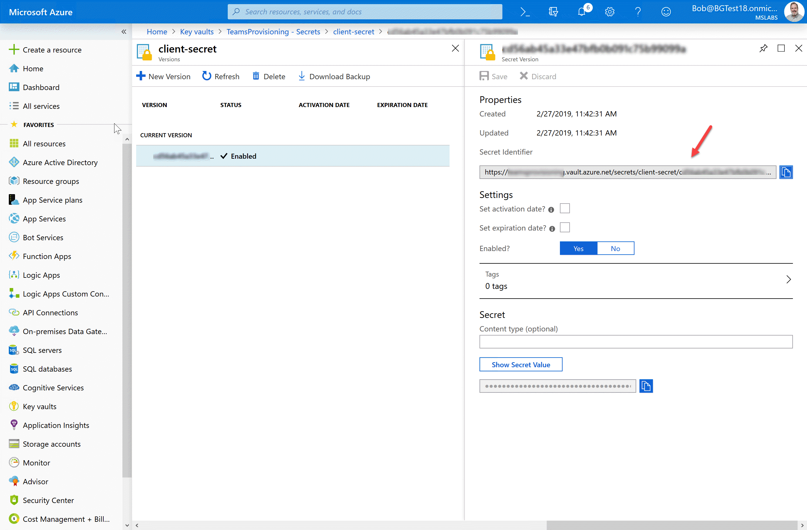
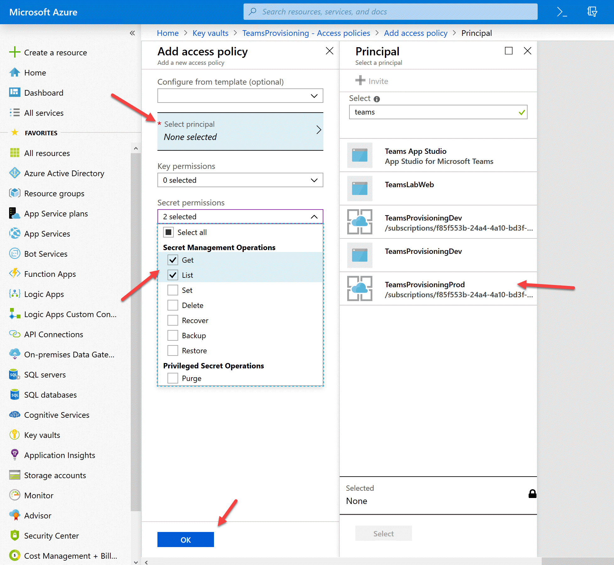
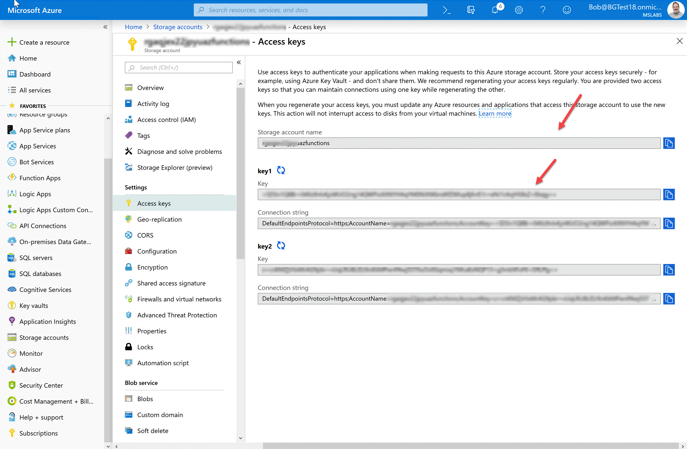
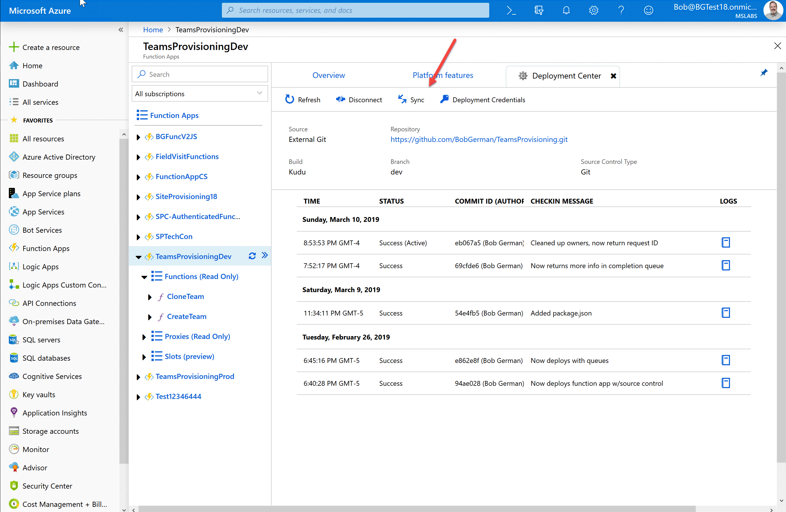
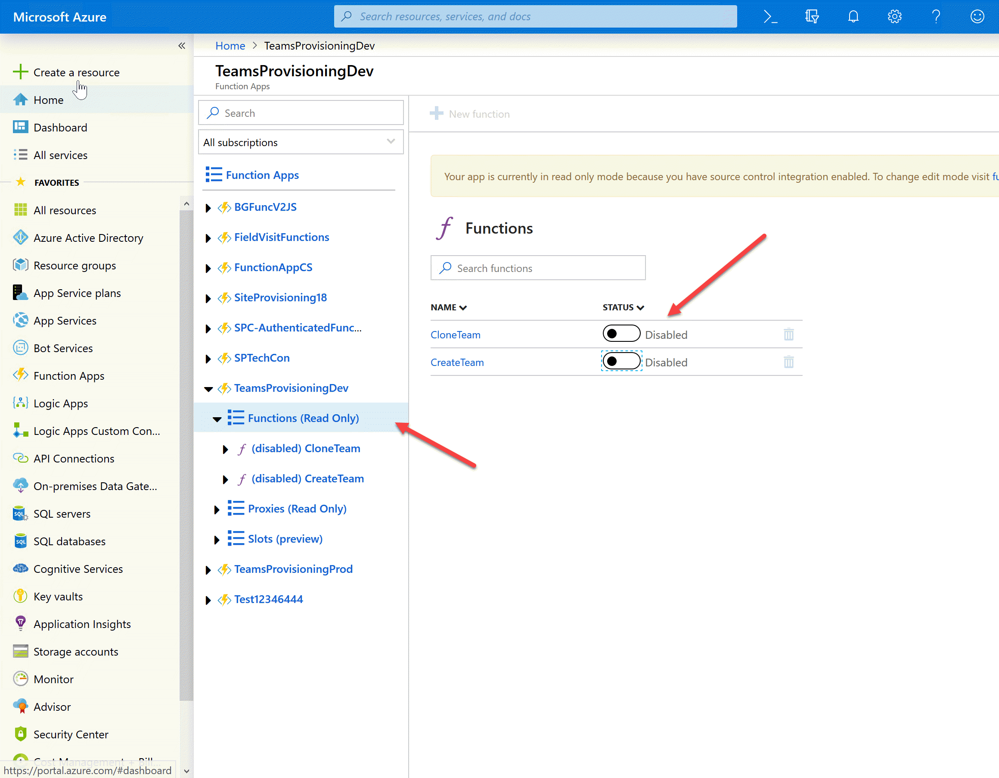

# Teams Provisioning Sample

## Part 2: Installing the Azure Functions

The good news is that this project comes with an Azure Resource Manager template, which creates and configures the Function App. This allows easy creation of development, staging, and production environments (or whatever environments you wish), and configures them for continuous deployment from Git. It also reduces the number of setup steps, but there are still several.

### 1. Set up your github repo

At the end of the setup, you'll have one or more Azure Function Apps set up for continuous deployment from a github repository ... but what github repository? While you could certainly deploy directly from this repo, it's probably not a good idea. Instead, fork the repo or copy it into a new github repo of your choosing. For simplicity, keep the file structure the same with the Function App at the root of the repository (i.e. don't copy this repo to a subfolder in another repo unless you're prepared to tweak the installation scripts).

Save this information for future steps:

 * The URL of the public github repo (or a private one that you've [set up a deploy key for](https://github.com/projectkudu/kudu/wiki/Continuous-deployment)
 * The name of the branch you want to deploy from

### 2. Create your Templates library

Determine what SharePoint site and library you want to use to store your JSON template files. This doesn't have to be fancy, but the code expects the JSON template files to be at the root of the library. Copy in the sample JSON template files from the Documentation/Samples directory into the library. Notice that the file names end in .json.txt; this is because SharePoint doesn't allow .json files. 

Save this information for future steps:

* The SharePoint site URL
* The SharePoint library name

### 3. Register the Application

In order to call Microsoft Graph with an application identity, we need to register an application in Azure AD. Begin in the Azure portal under Azure Active Directory; click "App Registrations" (not "App Registrations(Preview)", which is for Azure AD v2.)

Click the + at the top of the page to add a new application. Give your application a name, and keep the default Application Type at Web/API. The Sign-on URL isn't really used but since you're forced to provide one, choose https://localhost/.

Now click "Settings" and then "Grant Permissions". Click + and then select Microsoft Graph as the API. Notice that there are a large number of permissions; application permissions are near the top, followed by delegated permissions. In this case we need application permissions so make sure you're not assinging delegated ones! Specifically, you need to check off:

* Read and write all groups (Group.ReadWrite.All)
* Read all users' full profiles (User.Read.All)

Don't forget to Save and then use the "Grant Permissions" button to consent to the new permissions.

Now you need an application key (or "secret"); back under settings click "Keys". Add a new key description and select its lifetime. (Keep it to 1-2 years in Production and make a note to update the key before it expires!)

Save this information for future steps:

* Application ID (from the application blade in the Azure Portal)
* Application key (from the previous step)

NOTE: You may want separate applications for dev, staging, and production, etc. - if so, just repeat this step and save the values for each environment.

### 4. Set up Key Vault

The application key is supposed to really be secret! So store it safely away from prying eyes in Azure Key Vault. 

In the Azure portal under Key Vaults, click + to add a new key vault. Give it a name, location, and resource group. For best results, choose the same location that you plan to host the Azure functions in! However you probably shouldn't use the same resource group; you may want to delete the resource group(s) containing your Azure Function app and still reuse the app registration and its secret key stored in Key Vault.

In your new Key Vault, click Secrets and + to add a new one. Give the secret a name and paste in the Application Key from the previous step.

Within your new Secret, copy the current version's Secret Identifier.

Save this information for future steps:

* The KeyVault secret identifier

You may want to remove all other copies of the App Key (Client Secret) at this point; you won't need it again and it's very sensitive information.

### 5. Create parameters file

Download or clone the github repository from step 1. In the TeamsProvisioningRG folder, edit dev.parameters.json or prod.parameters.json, or make a copy of sample.parameters.json and name it for your target environment.

NOTE: Eventually you'll have a parameters file for each target environment.

Fill in the following values in the parameters file:

* appName: The name of your application, to be used in naming the Azure Resource Group and other Azure resources
* repoUrl: The URL of the github repo containing your Azure functions
* branch: The name of the github branch you want to deploy from
* TENANT: Your Azure tenant ID, which is called the "Directory ID" under Properties in the Azure AD blade in the Azure portal
* CLIENT_ID: The Application ID you registered in the Step 2
* CLIENT_SECRET: The string "@Microsoft.KeyVault()", adding the key vault secret ID from Step 3 between the parenthesis
* TEMPLATE_SITE_URL: The server-relative URL of the SharePoint site containing your JSON templates such as /sites/myProvisioningSite
* TEMPLATE_LIB_NAME: The name of the SharePoint library holding the JSON templates

Notice that the parameters file gives you the ability to use different app identities, Key Vaults, and SharePoint libraries in each environment if you so choose.

### 6. Create installation script

Edit and adapt one of the provided installation scripts (InstallDev.ps1 or InstallProd.ps1) with your desired resource group name, resource group location, and parameter file name.

### 7. Install the Resource Group with Function App

Ensure [Azure PowerShell](https://docs.microsoft.com/en-us/powershell/azure/azurerm/overview?view=azurermps-6.13.0) is installed. Run Connect-AzureRmService to connect to Azure, and then the Install command you just edited. The script should create:

* A resource group for your solution
* An Azure Function App set up with github deployment (it should build itself initially, thus creating the CreateTeam and CloneTeam functions)
* A storage account used by the Azure Function app, which will contain the Azure queues
* Four Azure queues - a request and completion queue each for creating and cloning Teams

### 8. Grant the application permission

At this point, your application will fail to authenticate because it can't read the app secret out of KeyVault. Go back to the KeyVault you created in step 4 and click "Access Policies". You should see an access policy for yourself. Add another for the Function App by enabling the List and Get secrets checkboxes and clicking Select Principal and finidng the application.

### 9. Obtain the storage account name and key for use in Flow

In the Azure Portal under Storage Accounts, find the storage account for your environment (the Resource Group name is an easy way to find it). Open it up by clicking on the Storage Account name then Access Keys, and save the Storage account name and one of the keys for use by Flow or PowerApps.

Save this information for future steps:

* Storage account name
* Storage account shared key

### Test your solution

You can test your solution without Flow, and it's a good idea to do so before proceeding!

Still in your storage account, click Overview and then Queues to view your storage queues. You should see four of them.

To test the Clone operation, add a message to the clone-team-request-queue, substituting your Team names:

~~~JSON
{"oldTeam":"oldTeamName","newTeam":"newTeamName"}
~~~

This will clone the old team and name it the new team. Note there are a number of caveats here including there's no way to assign new owners to the cloned Team at the time of this writing. Instead, it will have no owner for a couple hours, and then one of the original team's owners will be given ownership.

To test the Create operation, adjust this message for your environment and add it to the create-team-request-queue:

~~~JSON
{
  "requestId": "123",
  "displayName": "New team name",
  "description": "New team description",
  "owner": "someone@myTenant.onmicrosoft.com",
  "jsonTemplate": "EngineeringTemplate"
}
~~~

After a few minutes, a completion message should appear in the create-team-completion-queue.

~~~JSON
{
    "success": true,
    "requestId": "123",
    "teamId": "56dc0bb8-1134-4691-9b49-c19fea5af0fd",
    "teamUrl": "(link to the new team)",
    "teamName": "(name you requested)", "teamDescription": "(description you requested)",
    "owner": "someone@myTenant.onmicrosoft.com",
    "error": "" }
~~~

If there was an error, you'll get the same structure except success will be false and the error will be filled in with a (hopefully) meaningful error message.

### Updating the Code

To change the code, check it into the github branch you specified. Then navigate to the function app in the Azure Portal and on the Overview tab under Configured Features, select Deployment options configured with ExternalGit. 

Click the Sync button near the top to bring down the latest contents of the repo. (Azure also supports fully automated deployment, however the resource manager template in this project uses the manual option so you need to ckick Sync.)

### Debugging the code

NOTE: When debugging, you can use the Azure Queues from one of your real deployments - just be sure to disable the Azure Functions or you will race to read the queues before the live Azure Function does!

To debug with [Visual Studio Code](https://code.visualstudio.com/download), install (in addition to VS Code itself) the latest version of the [Azure Function Core Tools](https://github.com/Azure/azure-functions-core-tools).

Copy the local.settings.sample.json file to just local.settings.json (this file will not be checked into source control). In local.settings.json, enter all the values you used above with the exception of the CLIENT_SECRET - enter the secret itself, not the KeyVault location. (This is a good reason to develop in a separate tenant so developers don't have the client secret for your production tenant!)

Now, with the Azure Function folder open, click the debugger icon on the left of Visual Studio Code and then click the green arrow to build and run your project.

At this point, you can add messages to the queues as explained above, except your function will run locally and you can set breakpoints.