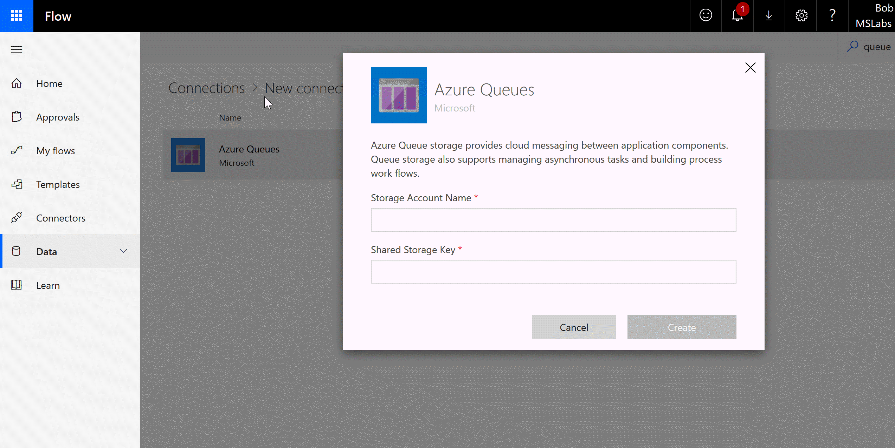
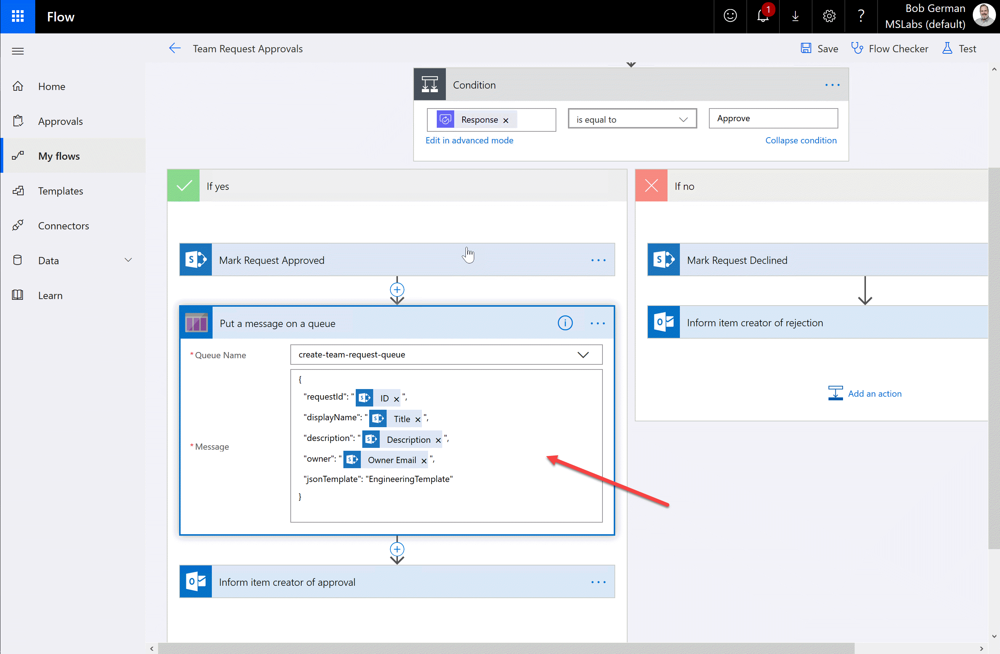

# Teams Provisioning Sample

## Part 3: Writing a Teams provisioning Flow

Now that you've got your Azure Functions ready, the fun begins: creating a Flow and/or PowerApp to provision Teams. Actually you'll want to create two Flows: one for handling requests (a PowerApp could do this directly), and one for handling completions.

To test the solution I created a simple request Flow based on a SharePoint list; users request a Team by adding a row to the list, and there is an approval step. The request flow places the list item ID in the requestId field to the Azure Function; this allows the completion flow to update the request list item after the function runs.

I'm no Flow expert but I can get around - so here I'll just show you how to connect a Flow to the solution and let you design the details.

### Connecting to the Azure Queues and Storage Account

First, in Flow, click the gear icon at the top of the screen and select Connections. Click + to add a new connection. Search for Azure queues and add one. Paste in the Storage Account Name and Shared Storage Key you saved from the Azure storage account.

### Creating a Request Flow

Create any request flow you wish, just make sure you capture the information you need:

* Team name
* Team description
* Owner (email or GUID)
* JSON template name
* Request ID (any value that will help the completion Flow to do its job)

When your logic is done and you've decided to go ahead and provision a Team, use the "Put a message on a queue" action to send the information.

Notice that the queue message is a JSON structure:

~~~JSON
{
  "requestId": 9999,
  "displayName": "New test team",
  "description": "Testing something new",
  "owner": "user@myTenant.onmicrosoft.com",
  "jsonTemplate": "EngineeringTemplate"
}
~~~

### Creating a completion flow

You need this Flow if only to empty the completion queue - unless you modify the Azure Function to stop using it! However it's a great opportunity to send the requester an email with the results - hopefully a link to their shiny new Team.

Create the Flow with a "When there are messages in a queue" trigger. Then add a "Parse JSON" action and pass in the Message Text from the trigger. Generate the schema from a sample message - this is what you can expect:

~~~JSON
{
    "success": true,
    "requestId": "9999",
    "teamId": "00000000-0000-0000-0000-000000000000",
    "teamUrl": "https://teams.microsoft.com/l/team/longgnarlyurl",
    "teamName": "New test team", "teamDescription": "Testing something new",
    "owner": "user@myTenant.onmicrosoft.com",
    "error": "" }
~~~

This should give you all the information you need to inform the user of success or inform an IT admin about any errors. 

NOTE: At the end of your flow, use the Delete Message action on the Azure Queue to delete the message you just processed; otherwise your Flow may run again and again processing the same completion!